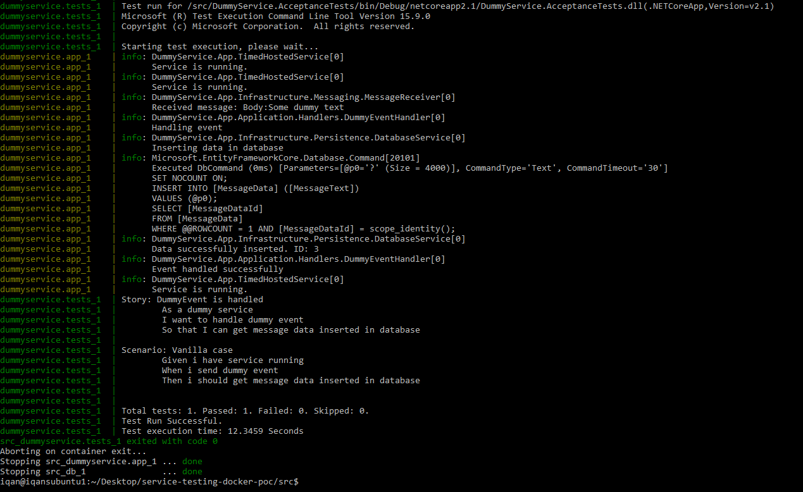

# service-testing-docker-poc
A proof of concept showcasing .Net Core service running in container and acceptance tests executing on it

## To run
- Go to src: `cd src/`
- Build docker containers `docker-compose build`
- Run tests in compose `docker-compose up --exit-code-from dummyservice.tests`

## Screenshots
